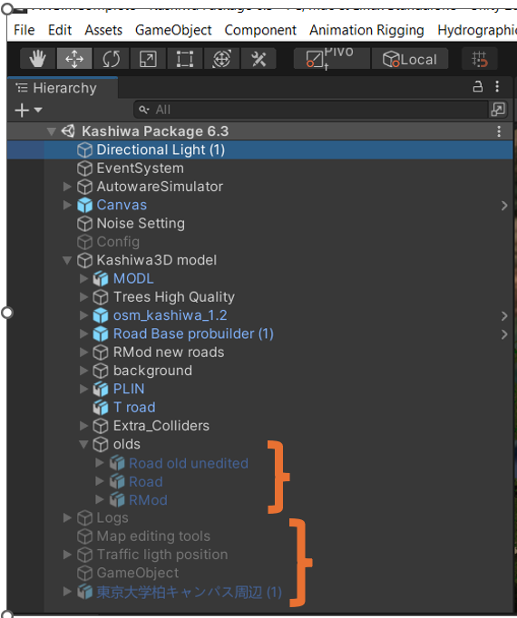

# Quick start demo

## 1. Simple AV project

### Repository Structure

This repository contains the following key directories:

- **simple_av/**: Contains the main nodes for the Simple_AV system, including `control.py`, `localization.py`, `perception.py` and `planning.py`.
- **V2X_messages/**: Includes the custom ROS message definitions that interface with the AWSIM environment.
- **simple_av_msgs/**: Defines internal message types used for communication between the Simple_AV nodes.
- **.github/workflows/**: Contains the GitHub Actions workflows for Continuous Integration (CI) and deployment of the documentation.
- **docs/**: The source files for the project documentation, written using MkDocs.
- **mkdocs.yml**: The configuration file for MkDocs, which defines the structure and theme of the documentation site.

### Getting Started

To use this project, you'll need to set up a ROS 2 workspace and clone the necessary packages.

#### Step 0: Setup the Environment.
Refer to the [system setup page](../../Simple-AV/SystemSetup/index.md) for detailed instructions.

#### Step 1: Create a ROS Workspace

First, create a new ROS workspace:

```bash
mkdir -p ~/ros_ws/src
```

#### Step 2: Clone the Repository

Next, clone this repository into the src directory of your workspace:
```bash
cd ~/ros_ws/src
git clone https://github.com/hoosh-ir/simple_av.git
```

#### Step 3: Build the Workspace

After cloning the repository, build the workspace using colcon:
```bash
cd ~/ros_ws/
colcon build
```

The workspace should look like this after running `colcon build`:
```bash
ros_ws/
├── build/
├── install/
├── log/
└── src/
    ├── docs/
    ├── mkdocs.yml
    ├── V2X_messages/
    ├── simple_av_msgs/
    └── simple_av/
        ├── package.xml
        ├── resource/
        ├── setup.cfg
        ├── launch/
        │   └── simple_av_launch.py
        └── simple_av/
            ├── control.py
            ├── localization.py
            └── planning.py
```

#### Step 4: Source the Workspace

Finally, source the workspace to make the ROS packages available:
```bash
source ~/ros_ws/install/setup.bash
```

#### Step 5: Running the project

You can run the project by either running the launch file or by manually starting each node in sequence.

Run the launch file:
```bash
ros2 launch simple_av simple_av_launch.py
```

Or, run the nodes manually:
```bash
ros2 run simple_av localization
ros2 run simple_av perception
ros2 run simple_av planning
ros2 run simple_av control
```


## 2. Awsim Environmet

### Windows
The current Windows build version is (v6.3.1).

You can download the build version(For Windows) to use our build version.

([Download Kashiwa Windows Build  files (unitypackage)](https://drive.google.com/file/d/1hGW9C7maw9ai5W3z4EPt-zqZW9fSKdd9/view?usp=drive_link) {.md-button .md-button--primary})


Right now build version is only available for Windows system.

You can use the build version in Windows and run Autoware and NetSim in WSL (Windows Subsystem for Linux). For installing the requirements for WSL, check [System Setup Process](https://tlab-wide.github.io/V2X_E2E_Simulator/Simple-AV/SystemSetup/).

For better performance, we suggest users use the build version, but the Unity project version is more flexible in terms of manipulating different parameters. 

### Ubuntu
Currently, the build version is not available for Ubuntu. However, you can follow the instructions in **How to build** section and build your Ubuntu version. 

please check the following section **How to build**. 


## How to build 

You can use the Kashiwa unity package and import it to Unity ([Setup Unity Project](https://tlab-wide.github.io/V2X_E2E_Simulator/GettingStarted/SetupUnityProject/)), then follow the below instructions for building the Ubuntu version. 


<div style="text-align: center;">
  
</div>


**Note**: Old models currently exist in the exported scene to be used in the future if required. We recommend deleting these objects from the scene when you are building your project to achieve better performance at runtime.

<div style="text-align: center;">
  
</div>


To build your project :

1. Ensure that your changes have been saved by pressing  **Ctrl + S**.
2. Go to **File > Build Settings**.

<div style="text-align: center;">
  
</div>


3. Drag and drop your scene into the box and make sure to check the highlighted checkbox.
4. Press **Build** and choose the location to save your project.

   
## Maps required for Autoware
To use Autoware in Kashiwa, Lanelet2 and point cloud (PCD) maps of Kashiwa are required. Download them from the following link.

[Kashiwa Lanelet2 and PCD](https://drive.google.com/drive/folders/1aklZH4lyZGqQW4MeGH41F5dYixLSlVyr?usp=drive_link){.md-button .md-button--primary}

PCD of Kashiwa is made from the 3D simulation environment to match both in simulation and Autoware. 
