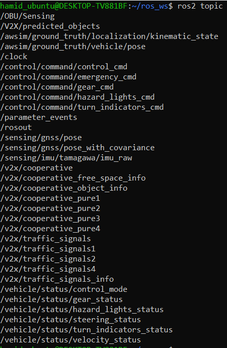

# Build AWSIM Messages

## Awsim Topics

AWSIM uses topics to send and receive data. It publishes data like position, lidar sensing, vehicle status, and even user-defined data using ROS topics. It also subscribes to topics containing control command data to move the vehicle.

A few of these topics, such as `gnss/sensing/pose` which determines the exact position of the vehicle, use messages that are already defined in ROS. However, other topics use custom messages that need to be defined to read and use them.

[Awsim ROS2 topic lists](https://tier4.github.io/AWSIM/Components/ROS2/ROS2TopicList/) Shows the full information on these topics and their relation. These topics can be shown on your system using the following process.

<b>Run Awsim and WSL</b>

First, run the Awsim or the built scene of it. You can use [this scene](TODO: link of the awsim scene). Secondly, Run the WSL and source the ROS2 init using the command below:

```bash
source /opt/ros/humble/setup.bash
```

After sourcing the ROS2 you can get a topic list and see all of the topics that are being published and subscribed by AWSIM. 



<b>Topics</b>

The list of Topics above shows all the topics related to Awsim. But, which one of them are being published by Awsim and which ones do the Awsim subscives to. Generally Awsim publishes all of the topics instead the Control command ones. You can see the full relation and published/subscribed topics using the command below.

```bash
rqt_graph
```

After running the command above a new window will appear. In this window unchek the `leaf topics'. As you can see all of the control topics are the ones that Awsim Subscribes to in order to control the vehicle. So by filling and publishing into these topics we can take control of the vehicle displayed in Awsim.


Now, if you uncheck the `dead sinks`, rqt-graph shows the topics that Awsim publishes.


------------------------------------------------------------

## Simple AV messages

To communicate with AWSIM and launch the Simple AV project, we need to build certain message types. First, we need to build the messages used by AWSIM to send and receive data from the scene. Then, we must build the internal messages for Simple AV. These messages handle communication between the Simple AV nodes, as shown in the [Simple AV architecture](https://hoosh-ir.github.io/simple_av/#architecture).

In the [Simple AV GitHub repository](https://github.com/hoosh-ir/simple_av), you will find two packages: V2X_messages and simple_av_msgs. After cloning this repository into the src folder of your workspace, build the entire project along with the messages using the colcon command. You can follow the steps below to create a ROS workspace and build the project. Alternatively, you can visit the [getting started]() guide or check the repository's README for full installation instructions.

### Step 1: Create a ROS Workspace

First, create a new ROS workspace:
```bash
mkdir -p ~/ros_ws/src
```

### Step 2: Clone the Repository

Next, clone this repository into the src directory of your workspace:
```bash
cd ~/ros_ws/src
git clone https://github.com/hoosh-ir/simple_av.git
```

### Step 3: Build the Workspace

After cloning the repository, build the workspace using colcon:
```bash
cd ~/ros_ws/
colcon build
```

The workspace should look like this after running `colcon build`:
```bash
ros_ws/
├── build/
├── install/
├── log/
└── src/
    ├── docs/
    ├── mkdocs.yml
    ├── V2X_messages/
    ├── simple_av_msgs/
    └── simple_av/
        ├── package.xml
        ├── resource/
        ├── setup.cfg
        ├── launch/
        │   └── simple_av_launch.py
        └── simple_av/
            ├── control.py
            ├── localization.py
            └── planning.py
```