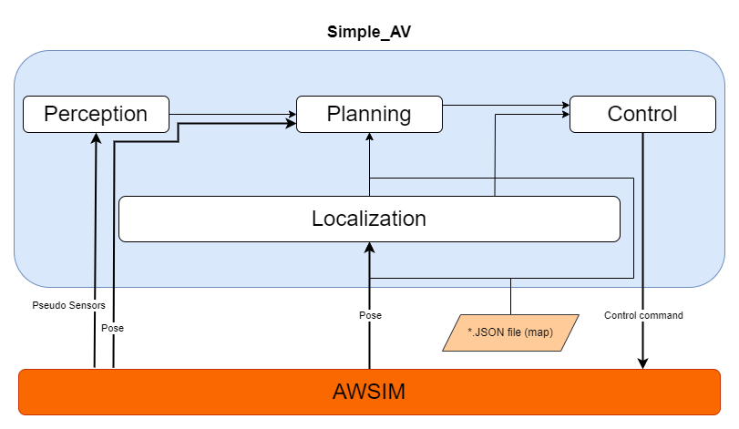

# Welcome to Simple AV project

simple-AV is an open-source software stack for self-driving vehicles, built on the [Robot Operating System (ROS)](https://www.ros.org/). simple-AV is written using Python, designed to facilitate autonomous vehicle simulation by <b>directly connecting to AWSIM and replacing the [Autoware](https://autoware.org/) framework</b>. It was created to provide a comprehensive framework for developing and testing autonomous vehicle systems.

## How it looks

<video width="1920" controls autoplay muted loop>
<source src="trailer.mp4" type="video/mp4">
</video>

The primary purpose of simple_AV is to ease the simulation and development of self-driving technologies by providing a robust, flexible, and easy-to-understand platform. Simple_AV includes all of the necessary functions to drive an autonomous vehicles from localization and object detection to route planning and control. While integrating AWSIM with Autoware is an effective approach, it often introduces substantial overhead. simple-AV aims to provide a more efficient solution by simplifying this process. 

This project focuses on ensuring seamless communication between AWSIM and the vehicle simulation tasks typically managed by Autoware, without the added complexity. By doing so, simple-AV offers a streamlined and effective method for autonomous vehicle simulation, handling all necessary tasks while minimizing setup and operational overhead.

#### Using AWSIM with simple-AV?

Simple-AV can be utilized with AWSIM for several key reasons. Firstly, simulators such as AWSIM provide a cost-effective and secure environment for testing and refining autonomous driving algorithms before they are implemented in real vehicles. Using simple-AV with a simulator allows developers to assess and adjust their algorithms without the risk of real-world accidents or damage. 

Furthermore, simulators allow developers to replicate complex driving scenarios, including challenging conditions or rare events, which are difficult to reproduce in real-world testing with high accuracy. The compatibility of simple-AV with AWSIM ensures smooth integration between the software and the simulated vehicle, enabling thorough testing and validation of autonomous driving functions. By employing a simulator, simple-AV can be rigorously tested in a variety of scenarios to confirm its robustness and reliability.

!!! note "Connection with simple-AV"
    Introduction about how the connection between AWSIM and simple-AV works can be read [here](Simple-AV/CommunicatingWithAWSIM/index.md).

## Architecture

In terms of architecture, simple-AV adopts a modular approach. It is composed of several independent modules that interact through ROS2. This modular design allows users to choose and integrate various modules according to their specific needs and requirements. The software stack includes several key components, such as perception, localization, planning, and control modules. Here’s a brief overview of each module:

- <b>*Sensing*</b> -  Data from sensors: different sensors mounted on the autonomous vehicle such as *LiDARs*, *Pseudo Sensors* and *cameras*. It pre-processing received data in order to later extract relevant information about the surrounding environment through the *Perception* module. More details [here](Simple-AV/Modules/Perception/index.md).

- <b>*Pose*</b> - Acquires data from sensors like *GNSS* and *IMU*. These data then will be used in order to determine the vehicle location  by the *Localization* module. More details [here](Simple-AV/Modules/Localization/index.md).

- <b>*Perception*</b> - Uses the information from [*Pseudo Sensors*](https://tlab-wide.github.io/V2X_E2E_Simulator/Components/PseudoSensors/PseudoSensors/) mounted on vehicle to sense the surrounding environment. This sensor shares the information such as location, type and Bounding box of the object. Perception module then uses these information to detect other vehicles, pedestrians, lane detection, and traffic lights. More details [here](Simple-AV/Modules/Perception/index.md).

- <b>*Localization*</b> - performs a fusion of data from *Sensing* module like *GNSS*, *IMU*, and odometry sensors to estimate the vehicle's position and orientation accurately. More details [here](Simple-AV/Modules/Localization/index.md).

- <b>*Planning*</b> - generates a safe and feasible trajectory for the autonomous vehicle based on the information gathered from *Perception* and *Localization*. It also takes into account various factors from *Map* like traffic rules and road conditions. More details [here](Simple-AV/Modules/Path_planning/index.md).

- <b>*Control*</b> - executes the planned trajectory by sending commands to the vehicle's actuators, such as steering, throttle, and braking. It ensures that the vehicle follows the desired trajectory while maintaining safety and stability. More details [here](Simple-AV/Modules/Control/index.md).

- <b>*Map*</b> - Simple_AV uses a .json file creted by Awsim as map. This map is a representation of the environment in which the autonomous vehicle operates. It uses data Awsim `waypoints` to generate the map (`*.json`). The map contains information about road geometries, lanes, traffic lights, rules, and other relevant features. Map serves as a crucial reference for planning and decision-making processes. More details [here](Simple-AV/JsonMap/index.md).
